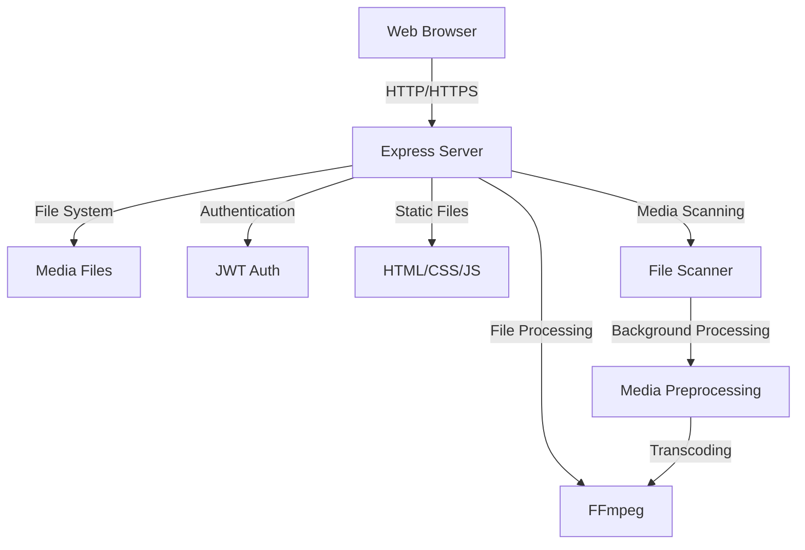

# Personal Media Server Documentation
## 1. Project Overview
The Personal Media Server is a lightweight, self-hosted application that allows you to stream your personal media collection (videos, TV shows, images, and audio) from any device on your local network. It's designed to be simple to set up and use, with a focus on providing quick access to your media library without complex configuration.
### Key Features
- **Media Categorization**: Automatically organizes media into categories (movies, TV shows, images, audio)
- **TV Show Organization**: Groups episodes by series name
- **Responsive Web Interface**: Mobile-friendly design that works on any device
- **Adaptive Streaming**: Converts media files to web-friendly formats
- **Subtitle Support**: Automatically detects and displays subtitle files
- **Search Functionality**: Quickly find content across your entire library
- **Background Preprocessing**: Optimizes media files for faster streaming
- **JWT Authentication**: Secure access to your media collection
- **Keyboard Shortcuts**: Enhanced playback controls
### Target Audience
- Home users who want to access their media collection on different devices
- Individuals who prefer self-hosted solutions over cloud services
- Users who want a simple, lightweight alternative to more complex media servers
### Technology Stack
- **Backend**: Node.js with Express
- **Frontend**: Vanilla JavaScript, HTML, CSS
- **Media Processing**: FFmpeg for transcoding and thumbnail generation
- **Authentication**: JWT (JSON Web Tokens)
- **Security**: Helmet for HTTP security headers
## 2. Table of Contents
1. [Project Overview](null)
2. [Table of Contents](null)
3. [Installation Guide](null)
  - [Prerequisites](null)
  - [Installation Steps](null)
  - [Verification](null)
4. [Architecture Documentation](null)
  - [System Architecture](null)
  - [Directory Structure](null)
  - [Design Patterns](null)
5. [Configuration Guide](null)
  - [Configuration Files](null)
  - [Media Storage Configuration](null)
6. [Media Management](null)
  - [Supported Media Types](null)
  - [Media Upload and Import](null)
  - [Media Organization](null)
7. [API Documentation](null)
  - [REST API Endpoints](null)
8. [User Guide](null)
  - [Web Interface](null)
9. [Administration Guide](null)
  - [User Management](null)
  - [Monitoring and Logging](null)
  - [Backup and Maintenance](null)
10. [Development Guide](null)
  - [Setting up Development Environment](null)
  - [Code Structure](null)
  - [Contributing Guidelines](null)
11. [Deployment Guide](null)
  - [Production Deployment](null)
12. [Troubleshooting](null)
  - [Common Issues](null)
  - [Debugging](null)
13. [Security](null)
  - [Authentication and Authorization](null)
  - [Data Protection](null)
14. [Performance and Optimization](null)
  - [Performance Tuning](null)
15. [FAQ](null)
## 3. Installation Guide
### Prerequisites
#### System Requirements
- **Operating System**: Linux, macOS, or Windows
- **Node.js**: v14.x or higher
- **FFmpeg**: Latest version recommended for transcoding and thumbnail generation
- **Storage**: Sufficient disk space for your media files plus transcoded versions
#### Required Software
- Node.js and npm
- FFmpeg with libx264 and aac codecs
- Git (for installation from source)
#### Network Requirements
- Open port for the server (default: 3000)
- Local network connectivity for client devices
### Installation Steps
16. Clone the repository:
```bash
git clone https://github.com/Yash-Jumde/media_server.git
cd media-server
```
17. Install dependencies:
```bash
npm install
```
18. Create required directories:
```bash
mkdir -p media/movies media/tv_shows media/images media/audio
mkdir -p thumbnails transcoded adaptive
```
19. Configure the server by creating a `.env` file (optional):
```
PORT=3000
JWT_SECRET=your_secret_key_here
ADMIN_PASSWORD=your_login_password
```
20. Start the server:
```bash
npm start
```
### Verification
21. Check the console output for successful startup messages:
```
Server running on http://localhost:3000
Access on your network at http://192.168.1.x:3000
```
22. Open a web browser and navigate to the URL shown in the console.
23. You should see a login page. Enter your configured password to access the media library.
## 4. Architecture Documentation
### System Architecture
The Personal Media Server follows a client-server architecture with a RESTful API.

**Data Flow**:
24. Client requests media list or specific media file
25. Server authenticates the request using JWT
26. Server scans directories or retrieves specific file
27. If needed, server transcodes media file to web-friendly format
28. Server sends response to client
29. Client renders media or plays video/audio
### Directory Structure
```
personal_server/
├── client/
│   └── public/            # Frontend static files
│       ├── app.js         # Main client-side application logic
│       ├── index.html     # Main HTML page
│       ├── login.html     # Login page
│       └── styles.css     # CSS styles
├── media/                 # Media storage directory
│   ├── movies/            # Movie files
│   ├── tv_shows/          # TV show files
│   ├── images/            # Image files
│   └── audio/             # Audio files
├── server/                # Server-side code
│   ├── middleware/        # Express middleware
│   │   ├── auth.js        # Authentication middleware
│   │   └── rangeRequest.js # Range request handler for streaming
│   ├── routes/            # API routes
│   │   └── tvshows.js     # TV shows specific routes
│   └── utils/             # Utility functions
│       ├── fileScanner.js # Media file scanning utilities
│       ├── mediaWatcher.js # Media file change detection
│       ├── thumbnailGenerator.js # Thumbnail creation
│       └── videoConverter.js # Video format conversion
├── thumbnails/            # Generated thumbnails directory
├── transcoded/            # Transcoded media files
├── adaptive/              # Adaptive streaming files
└── server.js              # Main server application
```
### Design Patterns
30. **Middleware Pattern**: The application uses Express middleware for authentication, logging, and request handling.
31. **Module Pattern**: Functionality is organized into modules (fileScanner, thumbnailGenerator, etc.) that expose specific functions.
32. **REST API**: The server exposes RESTful endpoints for client-server communication.
33. **Background Processing**: Media preprocessing happens asynchronously to avoid blocking the main thread.
34. **MVC-like Structure**: Separation of concerns between data handling (server/utils), routing (server.js), and presentation (client).
## 5. Configuration Guide
### Configuration Files
The main configuration is handled through environment variables or a `.env` file in the project root. Here are the key configuration options:
| Variable | Description | Default |
| :--- | :--- | :--- |
| PORT | Server port number | 3000 |
| JWT_SECRET | Secret key for JWT tokens | (none, must be set) |
| ADMIN_PASSWORD | Login password | (none, must be set) |
Example `.env` file:
```
PORT=8080
JWT_SECRET=my_super_secret_jwt_key
ADMIN_PASSWORD=my_secure_password
```
### Media Storage Configuration
The server expects media to be organized in specific directories under the main `MEDIA_DIR`:
```
MEDIA_DIR/
├── movies/      # Movie files
├── tv_shows/    # TV show files
├── images/      # Image files
└── audio/       # Audio files
```
TV shows can be further organized into subdirectories by series name:
```
tv_shows/
├── Game of Thrones/
│   ├── Game of Thrones S01E01.mp4
│   ├── Game of Thrones S01E02.mp4
│   └── ...
├── Breaking Bad/
│   ├── Breaking Bad S01E01.mp4
│   └── ...
└── ...
```
## 6. Media Management
### Supported Media Types
The server supports the following media formats:
**Video Formats**:
```javascript
// From fileScanner.js
const supportedFormats = {
    video: ['.mp4', '.webm', '.mkv', '.avi', '.mov', '.wmv', '.flv', '.m4v'],
    audio: ['.mp3', '.wav', '.ogg', '.flac', '.aac', '.m4a'],
    image: ['.jpg', '.jpeg', '.png', '.gif', '.webp', '.bmp']
};
```
### Media Upload and Import
To add media to the server:
35. **Manual File Transfer**: Copy media files to the appropriate subdirectories under `MEDIA_DIR`.
36. **File Structure**:
  - Movies: Place directly in `MEDIA_DIR/movies/`
  - TV Shows: Place in series-specific folders under `MEDIA_DIR/tv_shows/`
  - Images: Place in `MEDIA_DIR/images/`
  - Audio: Place in `MEDIA_DIR/audio/`
37. **Restart or Refresh**: After adding new files, either restart the server or reload the web interface to see the new content.
### Media Organization
#### TV Show Naming Conventions
The server uses pattern matching to extract series names from filenames:
```javascript
// From fileScanner.js
const patterns = [
    /^(.+?)\s+S\d+E\d+/i,          // "Series Name S01E01"
    /^(.+?)\s+Season\s+\d+/i,       // "Series Name Season 1"
    /^(.+?)\s+\d+x\d+/i,           // "Series Name 1x01"
    /^(.+?)\s+-\s+S\d+E\d+/i,      // "Series Name - S01E01"
    /^(.+?)\s+\[\d+x\d+\]/i,       // "Series Name [1x01]"
    /^(.+?)\s+\(\d{4}\)/i,         // "Series Name (2023)"
];
```
Using these naming conventions will help the server properly organize your TV shows.
## 7. API Documentation
### REST API Endpoints
#### Authentication
**Login**
- **URL**: `/api/login`
- **Method**: `POST`
- **Body**: `{ "password": "your_password" }`
- **Response**: `{ "token": "jwt_token" }`
- **Description**: Authenticates user and returns a JWT token
#### Media Access
**Get All Media**
- **URL**: `/api/media`
- **Method**: `GET`
- **Headers**: `Authorization: Bearer <token>`
- **Response**: JSON object with categorized media files
- **Description**: Returns all media files organized by category
**Stream Media**
- **URL**: `/stream/:filename`
- **Method**: `GET`
- **Headers**: `Authorization: Bearer <token>`
- **Response**: Video/audio stream
- **Description**: Streams the requested media file with range request support
**Get Image**
- **URL**: `/images/:filename`
- **Method**: `GET`
- **Headers**: `Authorization: Bearer <token>`
- **Response**: Image file
- **Description**: Returns the requested image file
**Get Thumbnail**
- **URL**: `/thumbnails/:filename`
- **Method**: `GET`
- **Headers**: `Authorization: Bearer <token>`
- **Response**: Thumbnail image
- **Description**: Returns a thumbnail for the specified media file
#### TV Shows Specific
**Get All TV Shows**
- **URL**: `/api/tv-shows`
- **Method**: `GET`
- **Headers**: `Authorization: Bearer <token>`
- **Response**: Array of TV series objects
- **Description**: Returns a list of all TV shows with basic information
**Get TV Series Details**
- **URL**: `/api/tv-shows/:seriesName`
- **Method**: `GET`
- **Headers**: `Authorization: Bearer <token>`
- **Response**: TV series object with episodes
- **Description**: Returns detailed information about a specific TV series
**Get Subtitles**
- **URL**: `/subtitles/:filename`
- **Method**: `GET`
- **Headers**: `Authorization: Bearer <token>`
- **Response**: WebVTT subtitle file
- **Description**: Returns subtitles for the specified media file if available
## 8. User Guide
### Web Interface
#### Login Screen
The first screen you'll see is the login screen. Enter your configured password to access the media library.
#### Main Media Library
After logging in, you'll see your media organized by categories:
38. **Movies**: All movie files
39. **TV Shows**: All TV series, grouped by show name
40. **Images**: All image files
41. **Audio**: All audio files
#### Navigation
- **Search Bar**: Filter media items by name
- **Category Headers**: Click to view only that category
- **TV Show Cards**: Click to view episodes within that series
#### Playing Media
42. **Videos/Movies**: Click on a video thumbnail to open the player
43. **TV Shows**: Click on a TV show to view episodes, then click an episode to play
44. **Images**: Click to view in full screen
45. **Audio**: Click to play audio file
#### Player Controls
The video player includes the following controls:
- Play/Pause
- Volume adjustment
- Fullscreen toggle
- Subtitle selection (if available)
#### Keyboard Shortcuts
When playing media, you can use these keyboard shortcuts:
- **Space**: Play/Pause
- **F**: Toggle fullscreen
- **M**: Mute/Unmute
- **Up/Down**: Volume adjustment
- **Left/Right**: Seek backward/forward
- **Esc**: Close player
## 9. Administration Guide
### User Management
The Personal Media Server uses a simple password-based authentication system. All users who know the password have full access to the media library.
To change the password:
46. Update the `PASSWORD` environment variable or in your `.env` file
47. Restart the server
### Monitoring and Logging
The server logs important events to the console, including:
- Server startup information
- Media scanning results
- Transcoding operations
- Error messages
Example server startup log:
```
Server running on http://localhost:3000
Access on your network at http://192.168.1.100:3000
Found 42 files in Movies
Found 156 files in TV Shows
Found 25 files in Images
Found 18 files in Audio
Total: 241 media files across 4 categories
Background preprocessing initiated. This will continue in the background.
```
### Backup and Maintenance
#### Media Files Backup
The server does not modify your original media files. It's recommended to:
48. Regularly back up your `MEDIA_DIR` directory
49. Consider the `transcoded` and `thumbnails` directories as cacheable - they can be regenerated if lost
#### Cleaning Cache
To clear cached files:
50. Stop the server
51. Delete contents of `thumbnails`, `transcoded`, and `adaptive` directories
52. Restart the server (files will be regenerated as needed)
## 10. Development Guide
### Setting up Development Environment
53. Clone the repository
54. Install dependencies:
```bash
npm install
```
55. Create a `.env` file with development settings
56. Start in development mode:
```bash
npm run dev
```
### Code Structure
#### Key Modules
57. [**server.js](file:///home/waltazar/Desktop/personal_server/server.js)**: Main application entry point, sets up Express server and routes
58. [**fileScanner.js](file:///home/waltazar/Desktop/personal_server/server/utils/fileScanner.js)**: Handles media file scanning and organization
```javascript
// Key functions:
scanDirectory            // Scans a directory for media files
scanDirectoryWithCategories // Scans media directory with category organization
scanTvShowsDirectory     // Special handling for TV shows
getTvSeriesDetails       // Gets details for a specific TV series
extractSeriesNameFromFile // Extracts series name from filename
preprocessMedia          // Background processing of media files
```
59. [**videoConverter.js](file:///home/waltazar/Desktop/personal_server/server/utils/videoConverter.js)**: Handles video transcoding
```javascript
// Key functions:
convertToMP4            // Converts video to MP4 format
needsConversion         // Checks if video needs conversion
getWebFriendlyPath      // Gets path to web-friendly version
```
60. [**app.js](file:///home/waltazar/Desktop/personal_server/client/public/app.js)**: Frontend JavaScript
```javascript
// Key classes and methods:
MediaPlayer            // Main class for the media player
renderCategorizedMedia // Renders media by category
groupTvShowsBySeries   // Groups TV shows by series name
showTvSeriesEpisodes   // Shows episodes for a TV series
play                   // Plays a media file
```
### Contributing Guidelines
If you want to contribute to the Personal Media Server:
61. **Code Style**: Follow the existing code style for consistency
62. **Testing**: Test your changes thoroughly before submitting
63. **Pull Requests**: Create a pull request with a clear description of changes
64. **Issues**: Report bugs or feature requests through the issue tracker

## 11. Troubleshooting
### Common Issues
#### Media Not Appearing in Library
**Problem**: Media files aren't showing up in the web interface.
**Solutions**:
69. Check that files are in the correct category directories
70. Verify file formats are supported (see [Supported Media Types](null))
71. Restart the server to trigger a fresh scan
72. Check server logs for scanning errors
#### Playback Issues
**Problem**: Videos won't play or play incorrectly.
**Solutions**:
73. Check if the video format is supported
74. Look for transcoding errors in the server logs
75. Try the "Force Transcode" option if available
76. Verify that FFmpeg is properly installed with all codecs
#### Authentication Problems
**Problem**: Can't log in or keep getting logged out.
**Solutions**:
77. Check that you're using the correct password
78. Verify the JWT_SECRET is properly set
79. Clear browser cookies and try again
80. Check for JWT token expiration settings
### Debugging
To enable more detailed logging:
81. Start the server with debug mode:
```bash
DEBUG=media-server:* npm start
```
82. Check logs for error messages and trace information
83. For frontend issues, use browser developer tools to:
  - Check for JavaScript errors in the Console tab
  - Monitor network requests for API failures
  - Inspect element state and styling
## 12. Security
### Authentication and Authorization
The Personal Media Server uses JWT (JSON Web Tokens) for authentication:
84. **Token Generation**: When a user logs in with the correct password, the server generates a JWT token.
85. **Token Verification**: The `authenticateToken` middleware verifies tokens:
```javascript
// From auth.js middleware
function authenticateToken(req, res, next) {
  const authHeader = req.headers['authorization'];
  const token = authHeader && authHeader.split(' ')[1];
     
  if (token == null) return res.sendStatus(401);
     
  jwt.verify(token, process.env.JWT_SECRET, (err, user) => {
    if (err) return res.sendStatus(403);
    req.user = user;
    next();
  });
}
```
86. **Protected Routes**: All media routes require a valid token.
### Data Protection
87. **Secure Headers**: The application uses Helmet middleware to set secure HTTP headers:
```javascript
app.use(helmet({ contentSecurityPolicy: false }));
```
88. **Network Isolation**: By default, the server only runs on your local network.
89. **File Access Control**: All media file access requires authentication.
## 13. FAQ
### General Questions
**Q: Can I access my media server from outside my home network?**
A: The server is designed for local network use by default. For external access, you would need to:
90. Set up port forwarding on your router
91. Use a dynamic DNS service
92. Implement additional security measures
93. Consider using a VPN instead for more secure remote access
**Q: How do I add new media to my library?**
A: Simply add files to the appropriate directories under your `MEDIA_DIR` and refresh the interface or restart the server.
**Q: Does the server modify my original media files?**
A: No, your original files remain untouched. The server creates transcoded copies and thumbnails in separate directories.
### Technical Questions
**Q: What are the recommended file naming conventions?**
A: For TV shows, follow patterns like:
- "Show Name S01E01 - Episode Title.mp4"
- "Show Name - 1x01 - Episode Title.mkv"
For movies, any naming convention is fine.
**Q: Where are transcoded files stored?**
A: Transcoded files are stored in the `transcoded` directory at the project root.
**Q: How can I customize the appearance of the web interface?**
A: Edit the CSS in [styles.css](file:///home/waltazar/Desktop/personal_server/client/public/styles.css) to customize the appearance.
**Q: Can I use this server with my smart TV or other media devices?**
A: Any device with a modern web browser can access the web interface. For dedicated media players, compatibility will depend on their ability to play media from web sources.